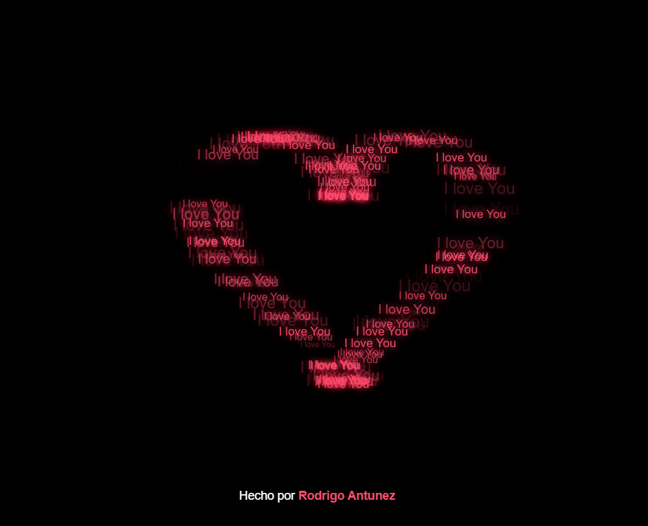

# Corazón Animado ❤️

Un proyecto visual e interactivo que genera un corazón latiendo en la pantalla, formado por múltiples textos que dicen "I love You". El posicionamiento de los elementos se basa en una ecuación matemática paramétrica para lograr la forma perfecta de un corazón.



## ✨ Características

- **Forma Matemática Real**: Utiliza la ecuación paramétrica del corazón para posicionar los elementos.
- **Efecto de Brillo**: Los textos tienen un sombreado (text-shadow) que simula un efecto de neón brillante.
- **Animaciones Dinámicas**: Cada elemento tiene un retraso de animación aleatorio, lo que da una sensación de movimiento fluido y orgánico.
- **Diseño Minimalista**: Fondo negro puro para resaltar los colores rosados y rojos del corazón.
- **100% Vanilla JS & CSS**: Sin librerías externas ni frameworks. Ligero y rápido.

## 🧮 ¿Cómo funciona?

El corazón se dibuja utilizando la siguiente ecuación paramétrica:

$$x = 16 \sin^3(t)$$
$$y = 13 \cos(t) - 5 \cos(2t) - 2 \cos(3t) - \cos(4t)$$

En el archivo `js/app.js`, se generan 150 puntos aleatorios utilizando esta fórmula, y se crea un elemento `div` para cada punto con el texto "I love You".

## 🚀 Instalación y Uso

No requiere de ninguna instalación compleja. Simplemente clona el repositorio o descarga los archivos y abre el archivo `index.html` en cualquier navegador web moderno.

```bash
# Clonar el repositorio
git clone https://github.com/tu-usuario/corazon-animado.git

# O simplemente abre index.html en tu navegador
```

## 🎨 Personalización

¡Puedes personalizar el texto del corazón muy fácilmente! 

1. Abre el archivo `js/app.js`.
2. Busca la línea donde se define el texto (alrededor de la línea 22):
   ```javascript
   el.innerText = "I love You";
   ```
3. Cambia `"I love You"` por el nombre de tu pareja o la frase que quieras.

### Ejemplos:
- **Con nombres**: `el.innerText = "Te amo María";`
- **Frases cortas**: `el.innerText = "Eres mi mundo";`
- **Emojis**: `el.innerText = "❤️ Flor ❤️";`

*Nota: Se recomienda usar frases cortas para que la forma del corazón se aprecie mejor.*

## 🛠️ Tecnologías Utilizadas

- **HTML5**: Estructura básica del proyecto.
- **CSS3**: Estilos, efectos de brillo y animaciones `@keyframes`.
- **JavaScript (Vanilla)**: Lógica para el cálculo matemático y generación dinámica de elementos.

## ✒️ Autor

* **Rodrigo Antunez** - [LinkedIn](https://www.linkedin.com/in/rodrigo-antunez-9523a6380)
